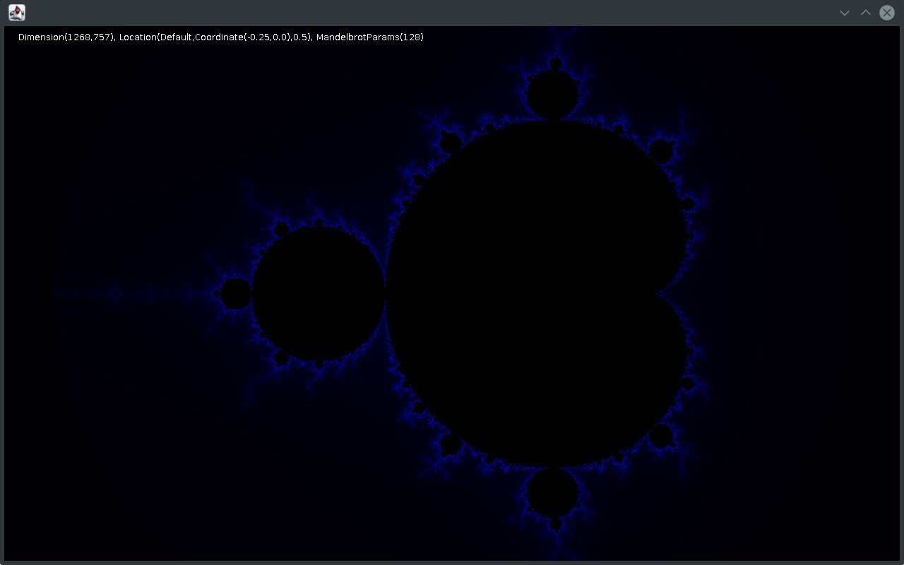

## Distributed fractal renderer.

I wrote this in February 2013 as an exercise in learning Scala and Akka. Slices of each frame can be rendered by remote worker actors. Work is distributed by the [work pulling pattern](http://www.michaelpollmeier.com/akka-work-pulling-pattern).

### Instructions

1. Optionally configure master IP and port in `src\main\resources\reference.conf` 
2. Run `sbt pack` to build the project.
3. Start a master node with GUI by executing script `target/pack/bin/akka-fractal`. This automatically starts a local worker actor.
4. Optionally create additional worker actors on remote machines with command `target/pack/bin/akka-fractal client`. They will connect to the master actor and request work.

GUI controls:

* Arrow keys to move around.
* a/z: Zoom in/out.
* s/x: Increase/decrease iterations.
* j/m: Switch to Julia/Mandelbrot set.
